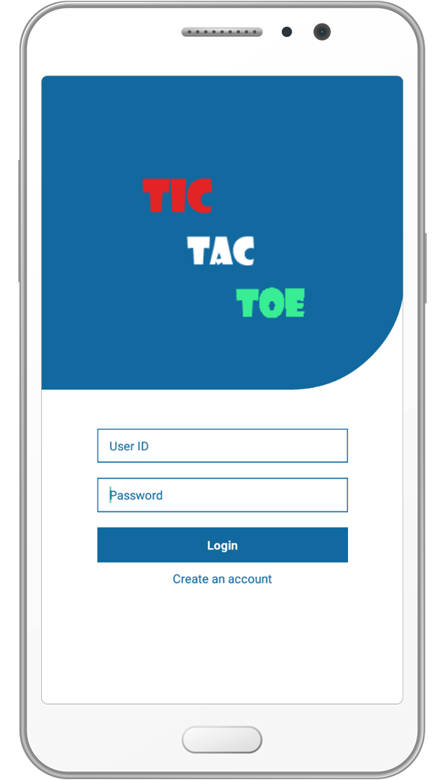
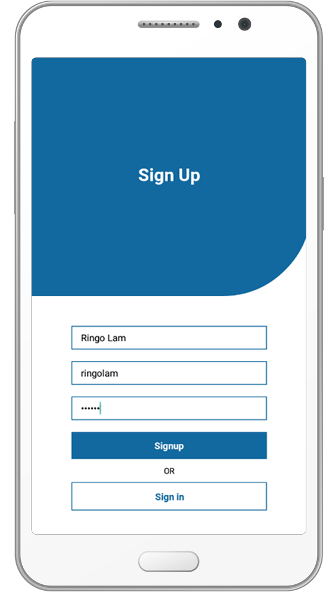
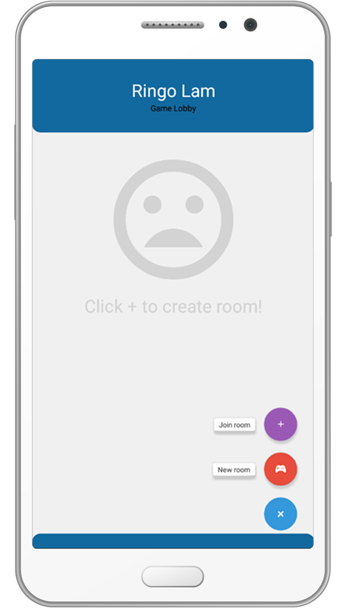
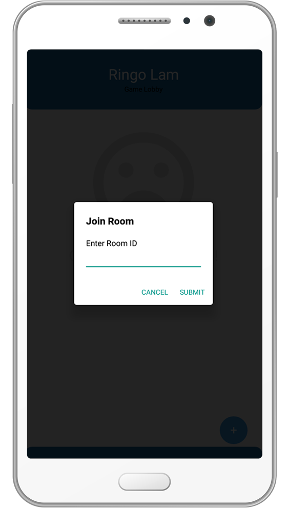
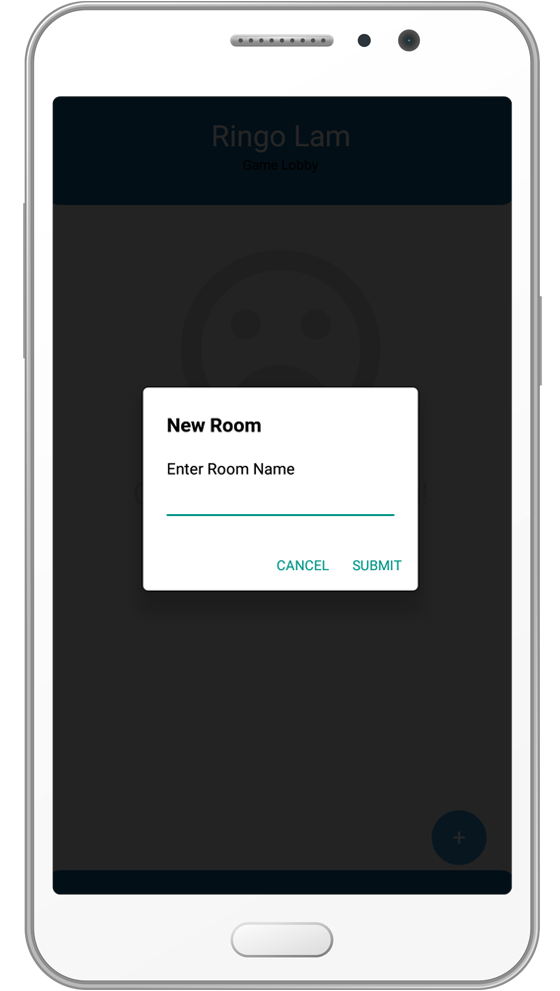
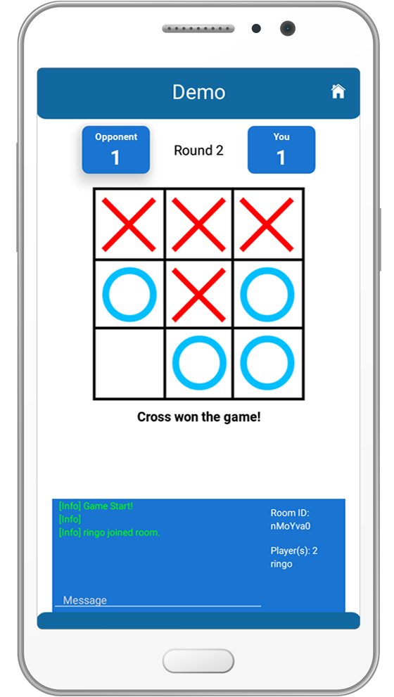
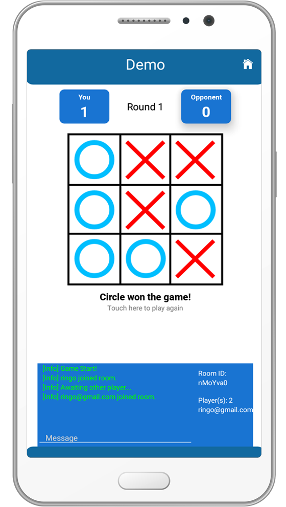
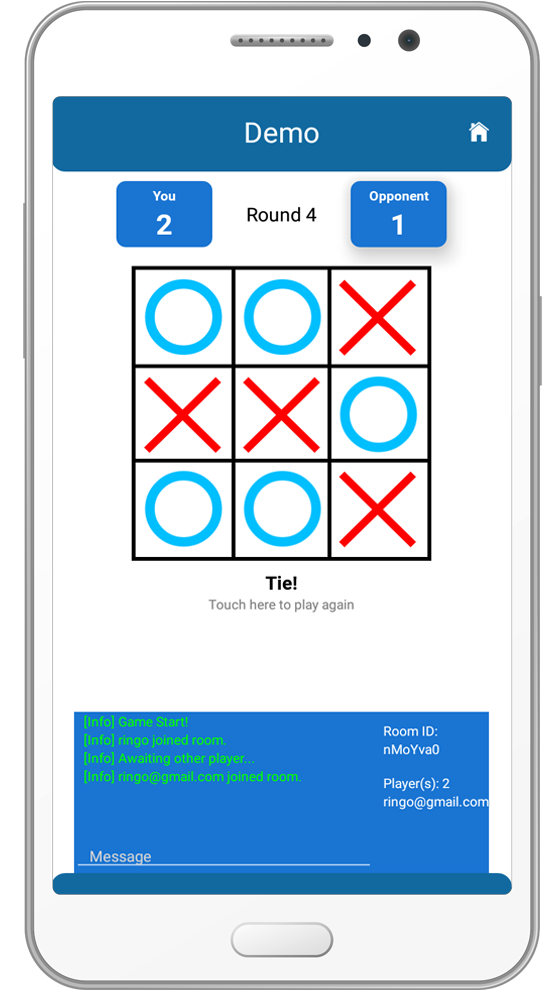
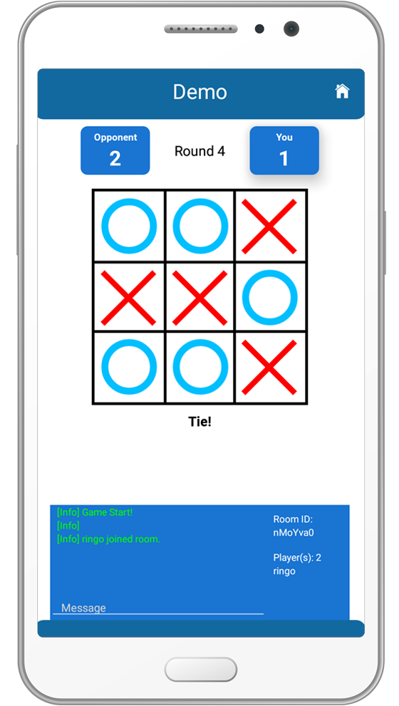
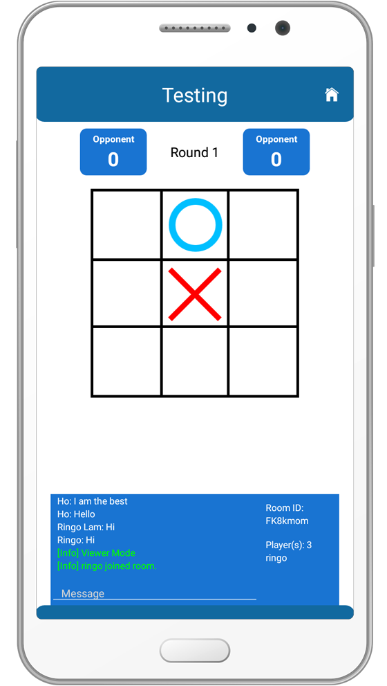

# Tic Tac Toe
*Tic Tac Toe* (this app) allow a player to host or join game with other players via internet. Players can enjoy the real-time gaming. The game result of each round will be counted until players leave the game room. Also, players can chat in the gaming room. 

## Main Functions screens
Login  

Signup  

Game Lobby 

Join game  

Create game 

Cross is winner  

Circle is winner  

Tie (no winner) 

Viewer mode 

Chatroom  

